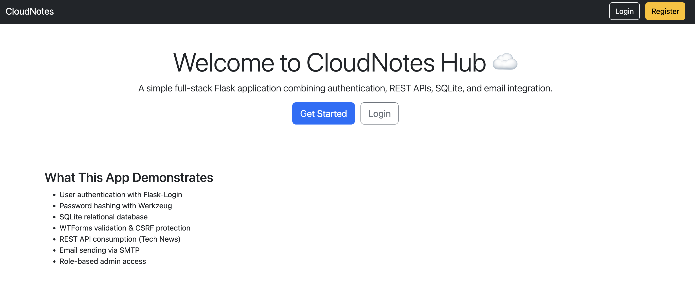
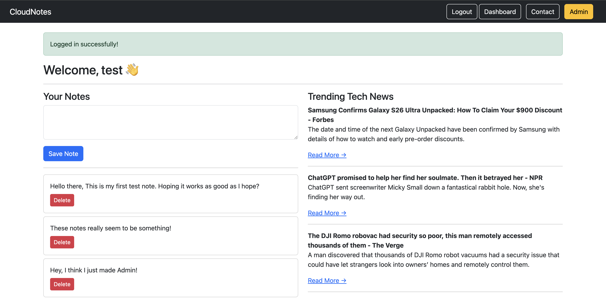
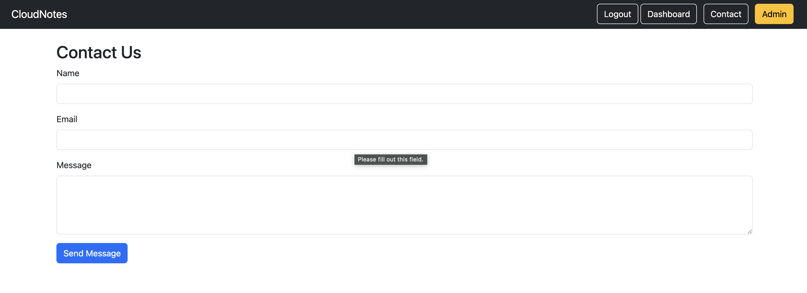

# CloudNotes Hub

CloudNotes Hub is a modular Flask web application I built to deepen and
demonstrate my backend development skills in Python and Flask.

This project is structured using production-style patterns --- including Blueprints,
an application factory, role-based access control, REST API integration,
and secure environment configuration.

This project reflects real-world backend architecture and clean
separation of concerns.

------------------------------------------------------------------------

## What This Project Demonstrates

This application showcases:

-   A modular Flask application using the Application Factory
    Pattern
-   Using Flask Blueprints
-   Secure authentication and session management with
    Flask-Login
-   Relational models using SQLAlchemy
-   Role-based access control (Admin vs User)
-   Integration of secure forms using WTForms with CSRF protection
-   Integration of external REST APIs (NewsAPI)
-   Handling secure email sending via SMTP (Gmail SMTP)
-   Managing environment variables properly using `.env`
-   Using Bootstrap and Jinja for dynamic, responsive UI

------------------------------------------------------------------------

## 🏗️ Project Structure

    cloudnotes/
    │
    ├── app.py               # Application factory
    ├── config.py            # Configuration
    ├── extensions.py        # DB + LoginManager setup
    ├── models.py            # Database models
    ├── forms.py             # WTForms definitions
    ├── email_utils.py       # Email logic
    │
    ├── auth/                # Authentication blueprint
    ├── main/                # Core routes (dashboard, contact)
    ├── admin/               # Admin-only routes
    │
    ├── templates/           # Jinja templates
    ├── static/              # Static assets
    ├── instance/            # SQLite database
    └── .env                 # Environment variables (not committed)

Blueprints are used to separate authentication, core application logic,
and administrative functionality --- mirroring production-grade Flask
architecture.

------------------------------------------------------------------------

## Features

### 🔐 Authentication

-   User registration
-   Secure password hashing (Werkzeug)
-   Login / Logout
-   Session management
-   CSRF protection

### Role-Based Access Control

-   Admin-only dashboard
-   Route protection using decorators
-   Proper 403 handling

### Notes System

-   Users can create and delete personal notes
-   Notes are tied to authenticated users
-   Admin has visibility across all users

### REST API Integration

-   Fetches real-time tech news from NewsAPI
-   Displays dynamic content in the dashboard

### Contact Form

-   WTForms validation
-   Email sending using Gmail App Password
-   Secure environment variable handling

### Frontend

-   Bootstrap 5
-   Jinja template inheritance
-   Flash messaging system

------------------------------------------------------------------------

## 📸 Screenshots
### Landing Page

### User Dashboard

### Contact Form


------------------------------------------------------------------------

## 🛠️ Tech Stack

-   Python 3
-   Flask
-   SQLAlchemy
-   Flask-Login
-   Flask-WTF
-   SQLite
-   Bootstrap
-   Jinja2
-   REST APIs
-   SMTP (Email Integration)
-   PostgreSQL (Production-ready relational database)
-   Flask-Migrate (Database schema version control)

------------------------------------------------------------------------

## ⚙️ Run Locally

### 1. Clone the repository

``` bash
git clone https://github.com/YOUR_USERNAME/cloudnotes.git
cd cloudnotes
```

### 2. Create and activate a virtual environment

``` bash
python3 -m venv venv
source venv/bin/activate   # Mac/Linux
```

Windows:

``` bash
venv\Scripts\activate
```

### 3. Install dependencies

``` bash
pip install -r requirements.txt
```

### 4. Create a `.env` file

    SECRET_KEY=your_secret_key
    EMAIL_USER=your_email@gmail.com
    EMAIL_PASS=your_gmail_app_password
    NEWS_API_KEY=your_newsapi_key

P.S: Gmail requires 2FA enabled and an App Password.

### 5. Initialize the database

``` bash
python3
```

``` python
from app import app
from extensions import db

with app.app_context():
    db.create_all()
```

### 6. Run the application

``` bash
python3 app.py
```

Visit:

    http://127.0.0.1:5000

------------------------------------------------------------------------

## 🔐 Creating an Admin User

After registering normally, promote a user manually:

``` python
from app import app
from models import User
from extensions import db

with app.app_context():
    user = User.query.filter_by(email="your_email@example.com").first()
    user.is_admin = True
    db.session.commit()
```

------------------------------------------------------------------------

## 🎯 Why I Built This

With a strong background in Cloud and DevOps, I wanted to deepen my
backend development skills and focus on application architecture,
authentication flows, and modular design.

This project helped me:

-   Understand blueprint-based structuring
-   Avoid circular imports
-   Implement secure credential management
-   Debug real-world SMTP authentication issues
-   Build a full application from scratch end-to-end

------------------------------------------------------------------------

## 🚀 Potential Improvements

-   Docker containerization
-   Deployment to AWS EC2
-   RDS integration
-   Redis caching layer
-   Flask-Migrate for database versioning
-   CI/CD pipeline (GitHub Actions)
-   Gunicorn + Nginx production deployment

------------------------------------------------------------------------

## 👤 Author

**Francis Kariuki**  
Solutions Engineer  

LinkedIn: [https://www.linkedin.com/in/francis8t/](https://www.linkedin.com/in/francis8t/)  
Portfolio: [https://gathuakariuki.com](https://gathuakariuki.com)

------------------------------------------------------------------------

⭐ If you found this project interesting, feel free to fork or star the
repository.
